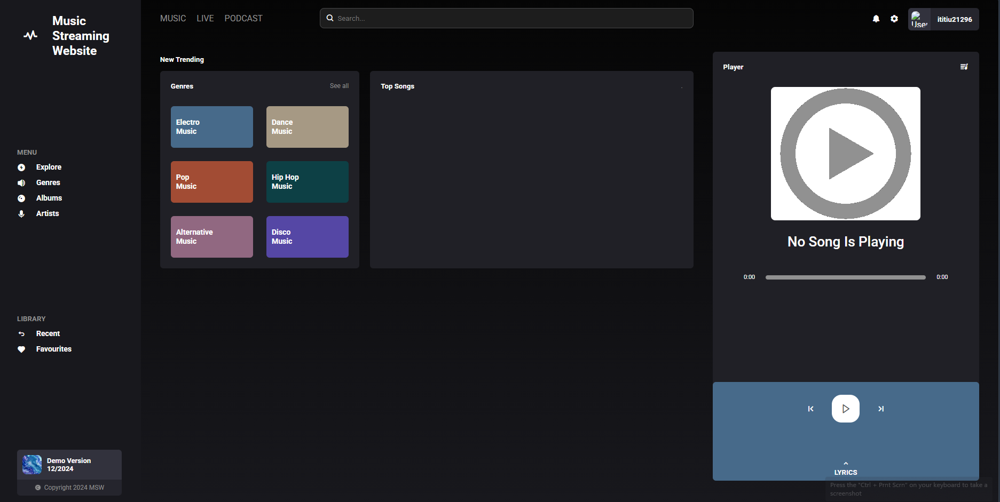

# Music Streaming Platform

Hey there! Welcome to my Fullstack Music Streaming Platform.

I built this project to dive deep into building a media-heavy application from scratch. It's a fully functional web app where users can explore artists, browse albums, play tracks continuously across different pages, and manage their favorite songs.

## What's Inside (Key Features)

- **Seamless Audio Player:** A custom global music player built with React Context API (`PlayerContext`). [cite_start]You can play, pause, skip tracks, and seek through a song, and the music won't stop when you navigate to another page.
- [cite_start]**Cloud Media Storage:** Integrated with **AWS S3** to fetch and stream audio files and images securely using Presigned URLs.
- **Smart "Recently Played" System:** The backend automatically tracks your listening history. [cite_start]It cleverly removes duplicate listens and limits your history to the 10 most recent tracks to keep the database optimized.
- [cite_start]**Secure Authentication:** User sign-up and login are secured using **JWT (JSON Web Tokens)** and **Bcrypt** for password hashing.
- [cite_start]**Favorites & Library:** Users can easily add or remove songs from their "Favorites" and view their listening stats.
- [cite_start]**Dynamic Content:** Browse by Genres, Top Trending songs (based on view counts), and dedicated Artist Profiles.

## Built With

**Frontend:**

- [cite_start]React.js (with React Router for navigation)
- [cite_start]Axios (for API requests)
- [cite_start]Pure CSS (Custom responsive grid layouts and animations)

**Backend:**

- [cite_start]Node.js & Express.js
- [cite_start]MySQL database with **Sequelize ORM**
- [cite_start]Multer (for handling file uploads)
- [cite_start]AWS SDK (for S3 bucket interactions)

---

## Getting Started

Want to run this locally? Follow these steps:

### 1. Clone the repository

\`\`\`bash
git clone https://github.com/yourusername/your-repo-name.git
cd your-repo-name
\`\`\`

### 2. Set up the Backend (Server)

Open a terminal and navigate to the server folder:
\`\`\`bash
cd server
npm install
\`\`\`

Create a `.env` file in the `/server` directory and add your environment variables (see the template below).

Start the backend server:
\`\`\`bash
npm start

# [cite_start]The server will run on http://localhost:5000

\`\`\`

### 3. Set up the Frontend (Client)

Open a new terminal and navigate to the client folder:
\`\`\`bash
cd client
npm install
\`\`\`

Start the React app:
\`\`\`bash
npm start

# The app will open in your browser at http://localhost:3000

\`\`\`

---

## Environment Variables (.env Template)

To run the backend properly, you'll need to create a `.env` file in your `server` folder. **Never commit your actual AWS keys to GitHub!** Use this template:

\`\`\`env

# Database Configuration

DB_HOST=127.0.0.1
DB_USER=root
DB_PASSWORD=your_database_password
DB_NAME=music_library

# JWT Secret

JWT_SECRET=your_jwt_secret_key_here

# AWS S3 Configuration

AWS_REGION=ap-southeast-2
AWS_BUCKET_NAME=your_bucket_name
AWS_ACCESS_KEY_ID=your_access_key
AWS_SECRET_ACCESS_KEY=your_secret_key
\`\`\`

---

## Folder Structure

\`\`\`text
/
├── client/ # React Frontend
│ ├── src/
│ │ ├── assets/ # Images and static files
│ │ ├── components/ # Reusable UI components (Sidebar, Player, etc.)
│ │ ├── context/ # Global state (PlayerContext)
│ │ └── App.js # Main routing
├── server/ # Node.js Backend
│ ├── api/ # Express routes (auth, albums, users, s3)
│ ├── models/ # Sequelize database models
│ ├── uploads/ # Local fallback storage
│ └── index.js # Server entry point
└── README.md
\`\`\`

---

## What I Learned

Building this project was a huge learning experience. Some of the biggest takeaways include:

- Managing complex relational databases using Sequelize ORM.
- Handling global state in React so audio continues playing without interruption during page reloads.
- Safely integrating third-party cloud services like AWS S3 into a Node environment.

---

_Designed and developed by [LNQ] - 2024._
